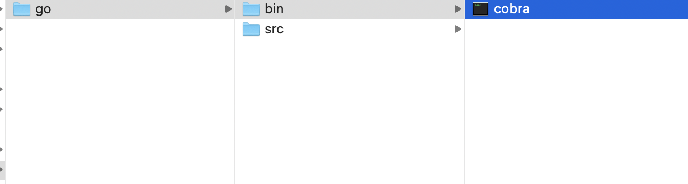
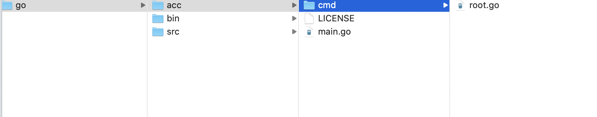
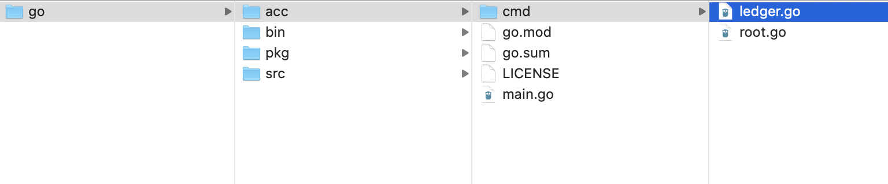

# Cobra cli tutorial
------------------------------
In this tutorial trying to cover creation of command creation using Cobra and adding sub command.

## Overview
> Cobra is both a library for creating powerful modern CLI applications as well as a program to generate 
>applications and command files.

## Prequisites
	* go (golang) pre-installed

### Create DIR and export GOPATH
Create directory structure as follows and set it as the GOPATH.

	mkdir -p /Users/dsinghvi/KM/test/go
	export GOPATH=/Users/dsinghvi/KM/test/go

Install Cobra.
<pre>
/Users/dsinghvi/KM/test/go$ <b>go get -u github.com/spf13/cobra/cobra</b>
</pre>	

    
Export PATH   

    export PATH=$GOPATH/bin:$PATH
    
Create a acc cli project using Cobra cli.   
<pre>
/Users/dsinghvi/KM/test/go$ <b>cobra init acc --pkg-name acc</b>
 </pre>    
 Output of the command is as follows
 
    Your Cobra application is ready at
    /Users/dsinghvi/KM/test/go/acc
    
New folder cmd and root.go is created and main.go folder acc will be executeed via the root command from the cmd/root.go    

build and install acc project
<pre>
    /Users/dsinghvi/KM/test/go/acc$ <b>go install acc</b>
    cannot find package "acc" in any of:
    	/usr/local/go/src/acc (from $GOROOT)
    	/Users/dsinghvi/KM/test/go/src/acc (from $GOPATH)
</pre>

You would ge the above error as by default go find the packages inside the GOROOT(default is $HOME/go) and 
GOPATH (set as above /Users/dsinghvi/KM/test/go).\
\
Create Go module inside the project which will find the package(s) in the project.

<pre>
/Users/dsinghvi/KM/test/go/acc$ <b>go mod init acc</b>

go: creating new go.mod: module acc
acc dsinghvi$ 
</pre>

Build and install acc project
<pre>
/Users/dsinghvi/KM/test/go/acc$ <b>go install acc</b>
</pre>

Run acc
<pre>
/Users/dsinghvi/KM/test/go/acc$ <b>acc</b>
</pre>
Has the following output

    A longer description that spans multiple lines and likely contains
    examples and usage of using your application. For example:
    
    Cobra is a CLI library for Go that empowers applications.
    This application is a tool to generate the needed files
    to quickly create a Cobra application.
    
Create another module or exeutable
<pre>
/Users/dsinghvi/KM/test/go/acc$ <b>cobra add ledger</b>

ledger created at /Users/dsinghvi/KM/test/go/acc
</pre>

New file ledger.go has been created

Now let us change the output which gets printed by default 
<pre>
var ledgerCmd = &cobra.Command{
	Use:   "ledger",
	Short: "Execute \"acc ledger\" to initiate ledger module",
	Long: `This is the ledger module for the accounting project`,
	Run: func(cmd *cobra.Command, args []string) {
		<b>fmt.Println("---Accounting Ledger Module---")</b>
	},
}
</pre>

build and install acc project again
<pre>
/Users/dsinghvi/KM/test/go/acc$ <b>go install acc</b>
</pre>

Run ledger
<pre>
/Users/dsinghvi/KM/test/go/acc$ <b>acc ledger</b>
</pre>

Has the following output

    ---Accounting Ledger Module---
